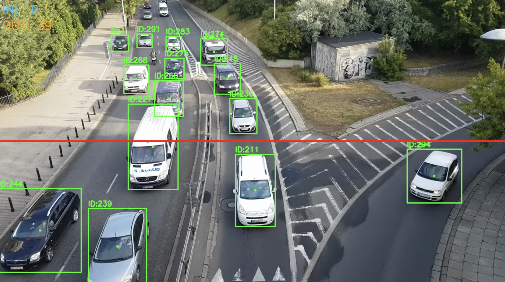

# Traffic Tracker — 车辆追踪 + 越线计数

基于 YOLOv8 + ByteTrack 的实时车辆检测追踪系统，支持虚拟计数线越线统计与方向判断。

## Demo



*YOLOv8 检测 + ByteTrack 追踪，红线为虚拟计数线，左上角实时显示 IN / OUT 计数。*

## 功能

- 多目标车辆检测（car / bus / truck / motorcycle）
- ByteTrack 跨帧 ID 追踪，遮挡后仍能保持同一 ID
- 虚拟计数线越线检测，输出 IN / OUT 方向计数
- 实时可视化：边框、ID、越线高亮、计数面板
- 支持视频文件、摄像头输入，可选保存输出视频

## 系统架构

```
视频帧 → YOLOv8检测 → ByteTrack追踪 → LineCounter越线判断 → 可视化输出
```

<svg viewBox="0 0 780 420" xmlns="http://www.w3.org/2000/svg" font-family="ui-monospace,monospace" font-size="13">
  <defs>
    <marker id="arr" markerWidth="8" markerHeight="8" refX="6" refY="3" orient="auto">
      <path d="M0,0 L0,6 L8,3 z" fill="#888"/>
    </marker>
  </defs>

  <!-- Video Source -->
  <rect x="20" y="30" width="130" height="54" rx="8" fill="#1e1e2e" stroke="#444" stroke-width="1.5"/>
  <text x="85" y="52" text-anchor="middle" fill="#cdd6f4" font-weight="600">Video Source</text>
  <text x="85" y="72" text-anchor="middle" fill="#888" font-size="11">mp4 / webcam / DETRAC</text>

  <line x1="150" y1="57" x2="188" y2="57" stroke="#888" stroke-width="1.5" marker-end="url(#arr)"/>

  <!-- YOLOv8 -->
  <rect x="190" y="30" width="140" height="54" rx="8" fill="#1e1e2e" stroke="#89b4fa" stroke-width="1.5"/>
  <text x="260" y="52" text-anchor="middle" fill="#89b4fa" font-weight="600">YOLOv8</text>
  <text x="260" y="72" text-anchor="middle" fill="#888" font-size="11">classes: car/bus/truck/moto</text>

  <line x1="330" y1="57" x2="368" y2="57" stroke="#888" stroke-width="1.5" marker-end="url(#arr)"/>

  <!-- ByteTrack -->
  <rect x="370" y="30" width="140" height="54" rx="8" fill="#1e1e2e" stroke="#a6e3a1" stroke-width="1.5"/>
  <text x="440" y="52" text-anchor="middle" fill="#a6e3a1" font-weight="600">ByteTrack</text>
  <text x="440" y="72" text-anchor="middle" fill="#888" font-size="11">persist ID across frames</text>

  <line x1="510" y1="57" x2="548" y2="57" stroke="#888" stroke-width="1.5" marker-end="url(#arr)"/>

  <!-- LineCounter -->
  <rect x="550" y="30" width="140" height="54" rx="8" fill="#1e1e2e" stroke="#f38ba8" stroke-width="1.5"/>
  <text x="620" y="52" text-anchor="middle" fill="#f38ba8" font-weight="600">LineCounter</text>
  <text x="620" y="72" text-anchor="middle" fill="#888" font-size="11">cross product side test</text>

  <!-- LineCounter detail -->
  <rect x="440" y="140" width="280" height="130" rx="8" fill="#1e1e2e" stroke="#f38ba8" stroke-width="1" stroke-dasharray="5,3"/>
  <text x="580" y="162" text-anchor="middle" fill="#f38ba8" font-weight="600" font-size="12">line_counter.py  logic</text>
  <text x="456" y="185" fill="#888" font-size="11">1. compute cross(line_vec, obj→line_start)</text>
  <text x="456" y="203" fill="#888" font-size="11">2. store side per track_id</text>
  <text x="456" y="221" fill="#888" font-size="11">3. sign flip  →  crossing event</text>
  <text x="456" y="239" fill="#a6e3a1" font-size="11">   +1 → −1  :  IN ↓</text>
  <text x="456" y="257" fill="#fab387" font-size="11">   −1 → +1  :  OUT ↑</text>

  <line x1="620" y1="84" x2="620" y2="138" stroke="#f38ba8" stroke-width="1.2" stroke-dasharray="4,3" marker-end="url(#arr)"/>

  <!-- Visualizer -->
  <rect x="20" y="200" width="340" height="130" rx="8" fill="#1e1e2e" stroke="#cba6f7" stroke-width="1.5"/>
  <text x="190" y="222" text-anchor="middle" fill="#cba6f7" font-weight="600">Visualizer  (main.py)</text>
  <rect x="40" y="235" width="70" height="42" rx="4" fill="none" stroke="#a6e3a1" stroke-width="1.5"/>
  <text x="75" y="251" text-anchor="middle" fill="#a6e3a1" font-size="10">ID:12</text>
  <circle cx="75" cy="265" r="3" fill="#a6e3a1"/>
  <rect x="130" y="235" width="70" height="42" rx="4" fill="none" stroke="#89b4fa" stroke-width="1.5"/>
  <text x="165" y="251" text-anchor="middle" fill="#89b4fa" font-size="10">ID:7  IN</text>
  <circle cx="165" cy="265" r="3" fill="#89b4fa"/>
  <line x1="40" y1="295" x2="340" y2="295" stroke="#f38ba8" stroke-width="2"/>
  <circle cx="40" cy="295" r="4" fill="#f38ba8"/>
  <circle cx="340" cy="295" r="4" fill="#f38ba8"/>
  <text x="230" y="252" fill="#89b4fa" font-weight="600" font-size="12">IN:  14</text>
  <text x="230" y="272" fill="#fab387" font-weight="600" font-size="12">OUT:  9</text>

  <line x1="440" y1="84" x2="440" y2="160" stroke="#888" stroke-width="1.2"/>
  <line x1="440" y1="160" x2="200" y2="160" stroke="#888" stroke-width="1.2"/>
  <line x1="200" y1="160" x2="200" y2="198" stroke="#888" stroke-width="1.2" marker-end="url(#arr)"/>

  <!-- Output -->
  <rect x="20" y="360" width="150" height="44" rx="8" fill="#1e1e2e" stroke="#444" stroke-width="1.5"/>
  <text x="95" y="380" text-anchor="middle" fill="#cdd6f4" font-size="12">output.mp4</text>
  <text x="95" y="396" text-anchor="middle" fill="#888" font-size="10">+ terminal count log</text>
  <line x1="95" y1="330" x2="95" y2="358" stroke="#888" stroke-width="1.2" marker-end="url(#arr)"/>

  <!-- Files legend -->
  <rect x="440" y="300" width="320" height="110" rx="8" fill="#1e1e2e" stroke="#444" stroke-width="1"/>
  <text x="600" y="320" text-anchor="middle" fill="#cdd6f4" font-weight="600" font-size="12">Files</text>
  <text x="456" y="340" fill="#888" font-size="11">config.py       — line coords, classes, colors</text>
  <text x="456" y="358" fill="#888" font-size="11">line_counter.py — crossing logic</text>
  <text x="456" y="376" fill="#888" font-size="11">main.py         — video loop + drawing</text>
  <text x="456" y="394" fill="#888" font-size="11">download_sample.py — fetch demo video</text>
</svg>

## 目录结构

```
traffic_tracker/
├── config.py           # 所有可调参数（模型、检测类别、计数线坐标、颜色）
├── line_counter.py     # 越线计数核心逻辑（叉积判断方向）
├── main.py             # 主推理循环 + 可视化
├── download_sample.py  # 下载演示视频
└── requirements.txt
```

## 安装

```bash
pip install -r requirements.txt
pip install yt-dlp   # 仅下载示例视频时需要
```

## 使用

```bash
# 下载示例视频（约60秒路口片段）
python download_sample.py

# 运行追踪，--line 指定计数线 x1,y1,x2,y2
python main.py --source sample_traffic.mp4 --line 0,360,1280,360

# 保存输出视频
python main.py --source sample_traffic.mp4 --line 0,360,1280,360 --output result.mp4

# 使用摄像头（0 为默认摄像头）
python main.py --source 0 --line 0,360,1280,360

# 无 GUI 模式（服务器环境）
python main.py --source video.mp4 --no-display --output result.mp4
```

按 `q` 退出，终端会打印最终统计：

```
[DONE] Processed 1800 frames
       Total IN : 23
       Total OUT: 19
```

## 参数调整

所有参数在 `config.py` 中集中管理：

| 参数 | 默认值 | 说明 |
|------|--------|------|
| `MODEL` | `yolov8n.pt` | 换成 `yolov8s.pt` 精度更高但更慢 |
| `VEHICLE_CLASSES` | `[2,3,5,7]` | COCO ID：car/motorcycle/bus/truck |
| `DEFAULT_LINE` | `(50,360,1230,360)` | 计数线像素坐标，可被 `--line` 覆盖 |
| `TRACK_CONF` | `0.3` | 检测置信度阈值 |

## 越线计数原理

以计数线向量 **L** 和"线起点→目标质心"向量 **P** 做叉积，正负号表示目标在线的哪一侧。相邻两帧符号翻转即判定为一次越线，方向由翻转前的符号决定：

```
side = (lx2-lx1)*(cy-ly1) - (ly2-ly1)*(cx-lx1)

+1 → -1 : IN  （从上方穿越到下方）
-1 → +1 : OUT （从下方穿越到上方）
```

叉积法天然防止同一辆车在线附近来回触发重复计数。

## 数据集

支持任意交通视频。如需标注数据集，可使用 [UA-DETRAC](https://detrac-db.rit.albany.edu/)（需注册），包含高速公路和路口场景的车辆检测追踪标注。
